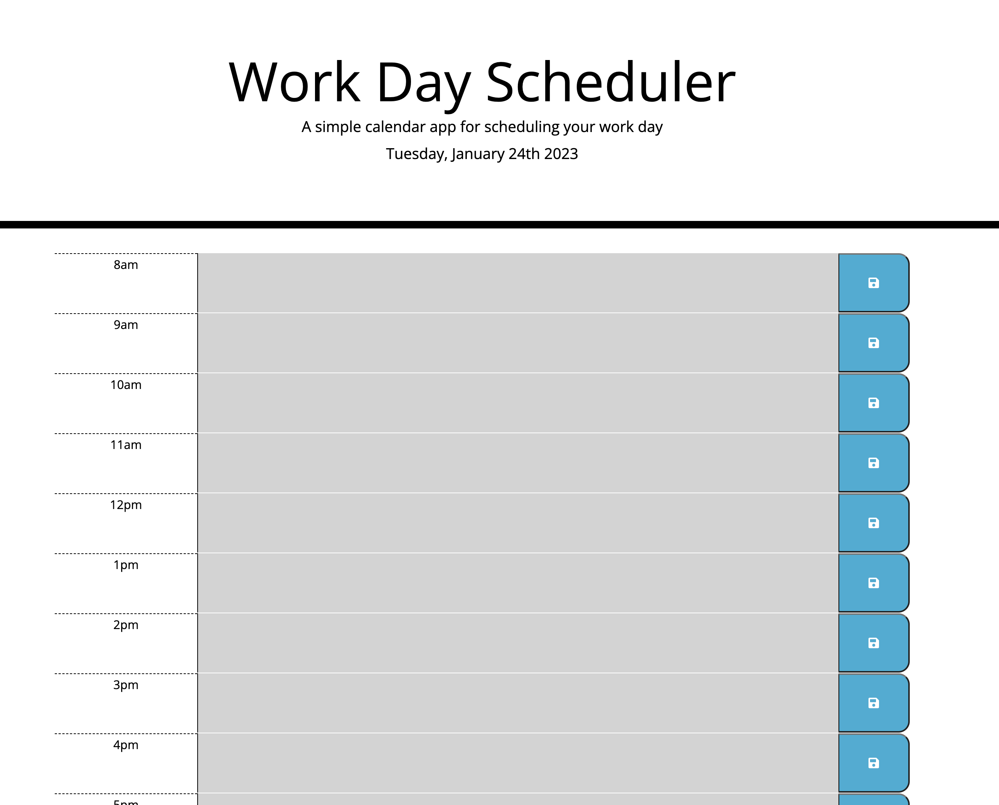

# Third-Party APIs: Scheduler

## Description

This application is a simple calendar that allows you to set your appointments, with a colour scheme, it helps you to visualize the appointments of the day divided into past, present and future. This application was build using HTML, CSS, JavaScript, JQuery, Bootstrap and Moment.js 

Deployed application: https://anawada.github.io/Scheduler/

## Usage 

Open the calendar and write your upcoming appointments. Then click save and that's it, you can go back to check or edit your daily appointments.

## License

None

